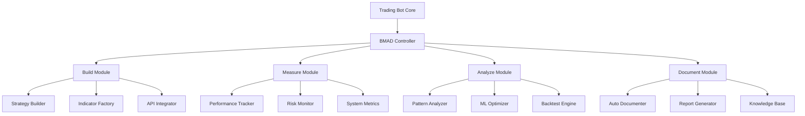

# BMAD Trading Bot Integration Guide

## Overview

This guide demonstrates how to integrate BMAD methodology into the Alpaca StochRSI-EMA Trading Bot project for systematic development, testing, and optimization of trading strategies.

## Integration Architecture



## Implementation Guide

### 1. Project Setup

```bash
# Initialize BMAD for trading bot
npx claude-flow bmad init --project "alpaca-trading-bot" --template trading

# Install dependencies
npm install claude-flow@alpha
pip install -r requirements.txt

# Configure BMAD
cp bmad.config.example.yml bmad.config.yml
```

### 2. BMAD Configuration

```yaml
# bmad.config.yml
project:
  name: alpaca-stochrsi-trading-bot
  type: trading
  version: 2.0.0

phases:
  build:
    duration: 4h
    auto_test: true
    components:
      - strategies
      - indicators
      - risk_management
      - api_integration
  
  measure:
    duration: 2h
    metrics:
      - trading_performance
      - system_performance
      - risk_metrics
    collection_interval: 60s
  
  analyze:
    duration: 3h
    techniques:
      - statistical_analysis
      - pattern_recognition
      - ml_optimization
    tools:
      - backtesting
      - monte_carlo
      - walk_forward
  
  document:
    duration: 1h
    auto_generate: true
    formats:
      - markdown
      - jupyter
      - api_docs

integration:
  alpaca:
    api_version: v2
    paper_trading: true
  
  database:
    type: postgresql
    metrics_retention: 90d
  
  monitoring:
    dashboard: true
    alerts: true
    port: 5000
```

### 3. Trading Strategy Integration

```python
# strategies/bmad_strategy.py
from bmad import BMADPhase, measure_performance, document

class BMADTradingStrategy:
    """Trading strategy with BMAD integration"""
    
    def __init__(self, config):
        self.config = config
        self.bmad = BMADPhase()
        self.metrics = {}
        
    @BMADPhase.build
    def build_strategy(self):
        """Build phase: Construct trading strategy"""
        print("BMAD Build: Initializing strategy components")
        
        # Build indicators
        self.indicators = self.build_indicators()
        
        # Build signal generator
        self.signal_generator = self.build_signal_generator()
        
        # Build risk manager
        self.risk_manager = self.build_risk_manager()
        
        # Validate build
        self.validate_build()
        
        return self
    
    @BMADPhase.measure
    @measure_performance
    def execute_trade(self, market_data):
        """Measure phase: Execute and measure trading"""
        start_time = time.time()
        
        # Generate signals
        signals = self.signal_generator.generate(market_data)
        
        # Apply risk management
        filtered_signals = self.risk_manager.filter(signals)
        
        # Execute orders
        orders = self.execute_orders(filtered_signals)
        
        # Collect metrics
        self.metrics['execution_time'] = time.time() - start_time
        self.metrics['signals_generated'] = len(signals)
        self.metrics['orders_placed'] = len(orders)
        
        return orders
    
    @BMADPhase.analyze
    def analyze_performance(self):
        """Analyze phase: Analyze trading performance"""
        analysis = {
            'returns': self.calculate_returns(),
            'risk_metrics': self.calculate_risk_metrics(),
            'patterns': self.identify_patterns(),
            'optimization': self.suggest_optimizations()
        }
        
        # ML-based analysis
        ml_insights = self.ml_analyze()
        analysis['ml_insights'] = ml_insights
        
        return analysis
    
    @BMADPhase.document
    @document(auto=True)
    def generate_documentation(self):
        """Document phase: Auto-generate documentation"""
        doc = {
            'strategy_name': self.__class__.__name__,
            'configuration': self.config,
            'performance': self.metrics,
            'analysis': self.analyze_performance(),
            'recommendations': self.generate_recommendations()
        }
        
        # Generate multiple formats
        self.export_markdown(doc)
        self.export_jupyter(doc)
        self.update_api_docs(doc)
        
        return doc
```

### 4. Indicator Development with BMAD

```python
# indicators/bmad_stoch_rsi.py
class BMADStochRSI:
    """StochRSI indicator with BMAD integration"""
    
    @BMADPhase.build
    def __init__(self, period=14, smoothing=3):
        """Build phase: Initialize indicator"""
        self.period = period
        self.smoothing = smoothing
        self.cache = {}
        
        # Build optimized calculation pipeline
        self.build_pipeline()
        
    def build_pipeline(self):
        """Build calculation pipeline"""
        self.pipeline = [
            self.calculate_rsi,
            self.calculate_stochastic,
            self.apply_smoothing
        ]
    
    @BMADPhase.measure
    def calculate(self, data):
        """Measure phase: Calculate with performance tracking"""
        with self.measure_execution():
            result = data
            for step in self.pipeline:
                result = step(result)
            
            # Track metrics
            self.track_calculation_metrics(result)
            
            return result
    
    @BMADPhase.analyze
    def analyze_indicator_performance(self):
        """Analyze phase: Analyze indicator effectiveness"""
        return {
            'signal_quality': self.assess_signal_quality(),
            'lag_analysis': self.analyze_lag(),
            'false_signals': self.count_false_signals(),
            'optimization_params': self.optimize_parameters()
        }
    
    @BMADPhase.document
    def document_indicator(self):
        """Document phase: Generate indicator documentation"""
        return {
            'name': 'BMAD Enhanced StochRSI',
            'parameters': {
                'period': self.period,
                'smoothing': self.smoothing
            },
            'performance': self.get_performance_metrics(),
            'usage_examples': self.generate_examples()
        }
```

### 5. Backtesting Integration

```python
# backtesting/bmad_backtest.py
class BMADBacktester:
    """Backtesting engine with BMAD integration"""
    
    def __init__(self, strategy, data):
        self.strategy = strategy
        self.data = data
        self.results = {}
        
    @BMADPhase.build
    def prepare_backtest(self):
        """Build phase: Prepare backtesting environment"""
        # Prepare data
        self.prepared_data = self.prepare_data(self.data)
        
        # Initialize portfolio
        self.portfolio = self.initialize_portfolio()
        
        # Setup metrics collectors
        self.metrics_collector = MetricsCollector()
        
    @BMADPhase.measure
    def run_backtest(self):
        """Measure phase: Execute backtest with metrics"""
        print("BMAD Measure: Running backtest simulation")
        
        for timestamp, market_data in self.prepared_data.iterrows():
            # Generate signals
            signals = self.strategy.generate_signals(market_data)
            
            # Execute trades
            trades = self.execute_trades(signals)
            
            # Update portfolio
            self.portfolio.update(trades, market_data)
            
            # Collect metrics
            self.metrics_collector.collect(
                timestamp=timestamp,
                portfolio=self.portfolio,
                trades=trades
            )
        
        self.results = self.metrics_collector.get_results()
        return self.results
    
    @BMADPhase.analyze
    def analyze_results(self):
        """Analyze phase: Comprehensive backtest analysis"""
        analysis = {
            'performance': self.analyze_performance(),
            'risk': self.analyze_risk(),
            'drawdowns': self.analyze_drawdowns(),
            'trade_analysis': self.analyze_trades(),
            'monte_carlo': self.run_monte_carlo(),
            'walk_forward': self.walk_forward_analysis()
        }
        
        # Generate optimization suggestions
        analysis['optimizations'] = self.suggest_optimizations()
        
        return analysis
    
    @BMADPhase.document
    def generate_report(self):
        """Document phase: Generate backtest report"""
        report = {
            'summary': self.generate_summary(),
            'detailed_results': self.results,
            'analysis': self.analyze_results(),
            'visualizations': self.create_visualizations(),
            'recommendations': self.generate_recommendations()
        }
        
        # Export report
        self.export_html_report(report)
        self.export_pdf_report(report)
        
        return report
```

### 6. Real-time Trading Integration

```python
# trading/bmad_live_trading.py
class BMADLiveTrading:
    """Live trading with BMAD methodology"""
    
    def __init__(self, strategy, api_client):
        self.strategy = strategy
        self.api = api_client
        self.bmad_cycle = BMADCycle()
        
    async def trading_loop(self):
        """Main trading loop with BMAD cycles"""
        while self.is_market_open():
            # Start BMAD cycle
            cycle_id = self.bmad_cycle.start()
            
            try:
                # BUILD: Prepare for trading
                await self.build_phase()
                
                # MEASURE: Execute and measure
                await self.measure_phase()
                
                # ANALYZE: Analyze performance
                await self.analyze_phase()
                
                # DOCUMENT: Update documentation
                await self.document_phase()
                
            except Exception as e:
                self.handle_error(e, cycle_id)
            
            finally:
                self.bmad_cycle.complete(cycle_id)
            
            # Wait for next cycle
            await asyncio.sleep(self.config['cycle_interval'])
    
    @BMADPhase.build
    async def build_phase(self):
        """Build: Prepare trading components"""
        # Update market data
        self.market_data = await self.fetch_market_data()
        
        # Rebuild indicators if needed
        if self.should_rebuild_indicators():
            self.strategy.rebuild_indicators()
        
        # Validate connections
        await self.validate_api_connection()
        
    @BMADPhase.measure
    async def measure_phase(self):
        """Measure: Execute trades and collect metrics"""
        # Generate signals
        signals = self.strategy.generate_signals(self.market_data)
        
        # Execute orders with measurement
        orders = await self.execute_orders_with_metrics(signals)
        
        # Track performance
        self.track_performance(orders)
        
    @BMADPhase.analyze
    async def analyze_phase(self):
        """Analyze: Real-time performance analysis"""
        # Analyze recent trades
        analysis = self.analyze_recent_performance()
        
        # Detect patterns
        patterns = self.detect_patterns()
        
        # Adjust strategy if needed
        if self.should_adjust_strategy(analysis):
            self.strategy.auto_adjust(analysis)
        
    @BMADPhase.document
    async def document_phase(self):
        """Document: Update live documentation"""
        # Generate cycle report
        report = self.generate_cycle_report()
        
        # Update dashboard
        await self.update_dashboard(report)
        
        # Log to database
        await self.log_to_database(report)
```

### 7. BMAD Dashboard Integration

```python
# dashboard/bmad_dashboard.py
from flask import Flask, render_template
from flask_socketio import SocketIO

class BMADDashboard:
    """Real-time BMAD dashboard"""
    
    def __init__(self):
        self.app = Flask(__name__)
        self.socketio = SocketIO(self.app)
        self.setup_routes()
        
    def setup_routes(self):
        """Setup dashboard routes"""
        
        @self.app.route('/')
        def index():
            return render_template('bmad_dashboard.html')
        
        @self.app.route('/api/bmad/status')
        def bmad_status():
            """Current BMAD cycle status"""
            return {
                'current_phase': self.get_current_phase(),
                'cycle_progress': self.get_cycle_progress(),
                'metrics': self.get_current_metrics()
            }
        
        @self.app.route('/api/bmad/metrics/<phase>')
        def phase_metrics(phase):
            """Get metrics for specific phase"""
            return self.get_phase_metrics(phase)
        
        @self.socketio.on('subscribe_metrics')
        def handle_subscription(data):
            """Subscribe to real-time metrics"""
            self.subscribe_client(data)
    
    def emit_metrics(self, metrics):
        """Emit real-time metrics to dashboard"""
        self.socketio.emit('metrics_update', metrics)
```

### 8. Automated BMAD Workflows

```yaml
# .github/workflows/bmad-cycle.yml
name: BMAD Trading Bot Cycle

on:
  schedule:
    - cron: '0 */4 * * *'  # Every 4 hours
  push:
    branches: [main]

jobs:
  bmad-cycle:
    runs-on: ubuntu-latest
    
    steps:
      - uses: actions/checkout@v2
      
      - name: Setup Environment
        run: |
          npm install claude-flow@alpha
          pip install -r requirements.txt
      
      - name: Build Phase
        run: |
          npx claude-flow bmad build "trading-strategy" \
            --config bmad.config.yml \
            --test
      
      - name: Measure Phase
        run: |
          npx claude-flow bmad measure "performance" \
            --duration 1h \
            --output metrics.json
      
      - name: Analyze Phase
        run: |
          npx claude-flow bmad analyze metrics.json \
            --type statistical \
            --ml-enabled \
            --output analysis.json
      
      - name: Document Phase
        run: |
          npx claude-flow bmad document "cycle-results" \
            --auto-generate \
            --deploy
      
      - name: Upload Results
        uses: actions/upload-artifact@v2
        with:
          name: bmad-results
          path: |
            metrics.json
            analysis.json
            docs/
```

## Best Practices

### 1. Strategy Development Workflow

```python
# Example: Developing new strategy with BMAD
def develop_strategy_with_bmad():
    """Complete BMAD workflow for strategy development"""
    
    # Initialize BMAD cycle
    cycle = BMADCycle(name="new_strategy_development")
    
    # BUILD: Create strategy
    with cycle.build_phase():
        strategy = build_new_strategy()
        validate_strategy(strategy)
    
    # MEASURE: Test performance
    with cycle.measure_phase():
        backtest_results = run_backtest(strategy)
        paper_trading_results = run_paper_trading(strategy, duration="1w")
    
    # ANALYZE: Evaluate results
    with cycle.analyze_phase():
        analysis = analyze_combined_results(backtest_results, paper_trading_results)
        optimizations = identify_optimizations(analysis)
    
    # DOCUMENT: Create documentation
    with cycle.document_phase():
        generate_strategy_docs(strategy, analysis)
        update_knowledge_base(optimizations)
    
    return cycle.get_results()
```

### 2. Continuous Improvement Loop

```python
# Automated improvement loop
async def continuous_improvement_loop():
    """Continuous BMAD improvement loop"""
    
    while True:
        # Run BMAD cycle
        cycle_results = await run_bmad_cycle()
        
        # Check for improvements
        if cycle_results['improvements_found']:
            # Apply improvements
            await apply_improvements(cycle_results['improvements'])
            
            # Validate improvements
            validation = await validate_improvements()
            
            # Document changes
            await document_improvements(validation)
        
        # Wait for next cycle
        await asyncio.sleep(CYCLE_INTERVAL)
```

### 3. Risk Management Integration

```python
class BMADRiskManager:
    """Risk management with BMAD integration"""
    
    @BMADPhase.measure
    def assess_risk(self, position):
        """Measure risk metrics"""
        return {
            'position_risk': self.calculate_position_risk(position),
            'portfolio_risk': self.calculate_portfolio_risk(),
            'market_risk': self.calculate_market_risk(),
            'execution_risk': self.calculate_execution_risk()
        }
    
    @BMADPhase.analyze
    def analyze_risk_patterns(self):
        """Analyze risk patterns"""
        return {
            'risk_concentrations': self.identify_concentrations(),
            'correlation_risks': self.analyze_correlations(),
            'tail_risks': self.analyze_tail_risks(),
            'stress_scenarios': self.run_stress_tests()
        }
```

## Monitoring and Alerts

### BMAD Cycle Monitoring

```python
# monitoring/bmad_monitor.py
class BMADMonitor:
    """Monitor BMAD cycles"""
    
    def __init__(self):
        self.alerts = []
        self.thresholds = self.load_thresholds()
        
    def monitor_cycle(self, cycle):
        """Monitor BMAD cycle execution"""
        
        # Check phase durations
        if cycle.build_duration > self.thresholds['build_max']:
            self.alert(f"Build phase exceeded threshold: {cycle.build_duration}")
        
        # Check metrics
        if cycle.measure_metrics['error_rate'] > self.thresholds['error_rate']:
            self.alert(f"High error rate: {cycle.measure_metrics['error_rate']}")
        
        # Check analysis results
        if cycle.analyze_results['risk_score'] > self.thresholds['risk_max']:
            self.alert(f"High risk detected: {cycle.analyze_results['risk_score']}")
        
        # Check documentation completeness
        if cycle.document_coverage < self.thresholds['doc_min']:
            self.alert(f"Low documentation coverage: {cycle.document_coverage}")
```

## Troubleshooting

### Common Issues and Solutions

| Issue | Solution |
|-------|----------|
| Slow build phase | Optimize indicator calculations, use caching |
| Measurement gaps | Increase collection frequency, add redundancy |
| Analysis timeout | Reduce data window, optimize algorithms |
| Documentation lag | Enable auto-generation, use templates |

### Debug Commands

```bash
# Debug BMAD integration
npx claude-flow bmad debug --component trading-bot --verbose

# Check cycle status
npx claude-flow bmad status --cycle current

# Validate configuration
npx claude-flow bmad validate --config bmad.config.yml
```

## Conclusion

Integrating BMAD methodology into the trading bot provides a systematic approach to development, testing, and optimization. The four-phase cycle ensures continuous improvement while maintaining comprehensive documentation and metrics tracking.

---

*BMAD Trading Bot Integration Guide v2.0.0*
*Part of BMAD Methodology Documentation*