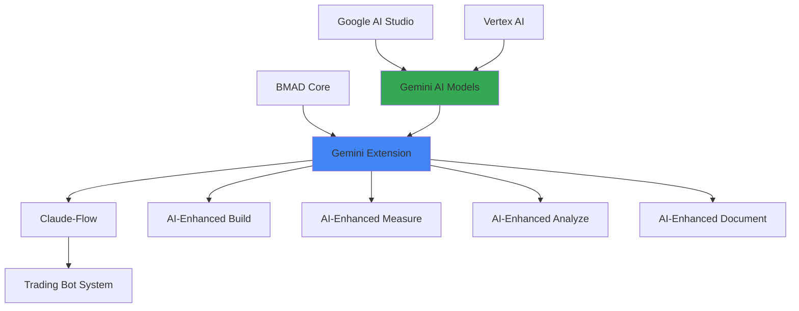

# BMAD-Gemini Extension Integration

## Overview

This document outlines the integration between BMAD methodology and the Gemini extension, enabling seamless AI-assisted development workflows that leverage Google's Gemini models for enhanced analysis, documentation, and optimization.

## Integration Architecture



## Gemini Extension Setup

### 1. Installation and Configuration

```bash
# Install Gemini extension for Claude-Flow
npm install -g @claude-flow/gemini-extension@latest

# Configure Gemini API credentials
npx claude-flow config set gemini.api_key $GEMINI_API_KEY
npx claude-flow config set gemini.project_id $GOOGLE_PROJECT_ID

# Enable Gemini in BMAD configuration
npx claude-flow bmad config set ai.provider gemini
npx claude-flow bmad config set ai.models "gemini-pro,gemini-pro-vision"
```

### 2. BMAD-Gemini Configuration

```yaml
# bmad-gemini.config.yml
gemini_integration:
  enabled: true
  models:
    analysis: "gemini-pro"           # For data analysis
    code_review: "gemini-pro"        # For code analysis
    documentation: "gemini-pro"      # For doc generation
    vision: "gemini-pro-vision"      # For chart analysis
  
  features:
    code_analysis: true
    pattern_recognition: true
    documentation_generation: true
    performance_insights: true
    risk_assessment: true
    chart_analysis: true
  
  safety_settings:
    harassment: "BLOCK_MEDIUM_AND_ABOVE"
    hate_speech: "BLOCK_MEDIUM_AND_ABOVE"
    sexually_explicit: "BLOCK_HIGH"
    dangerous_content: "BLOCK_MEDIUM_AND_ABOVE"
  
  generation_config:
    temperature: 0.3
    top_p: 0.8
    top_k: 40
    max_output_tokens: 8192

phase_enhancement:
  build:
    gemini_features:
      - code_review
      - architecture_analysis
      - test_generation
  
  measure:
    gemini_features:
      - metric_interpretation
      - anomaly_detection
      - performance_insights
  
  analyze:
    gemini_features:
      - pattern_recognition
      - correlation_analysis
      - predictive_insights
      - chart_analysis
  
  document:
    gemini_features:
      - auto_documentation
      - knowledge_extraction
      - tutorial_generation
```

## Phase-Specific Gemini Integration

### BUILD Phase Enhancement

#### AI-Assisted Code Review
```python
class GeminiCodeReviewer:
    """Gemini-powered code review for BMAD Build phase"""
    
    def __init__(self):
        self.gemini = GeminiClient(model="gemini-pro")
        self.trading_context = TradingBotContext()
    
    async def review_trading_strategy(self, code, context):
        """AI-powered trading strategy code review"""
        
        prompt = f"""
        You are an expert trading systems developer. Review this trading strategy code for:
        1. Logic correctness and edge cases
        2. Risk management implementation
        3. Performance optimization opportunities
        4. Code quality and maintainability
        5. Trading-specific best practices
        
        Context: {context}
        
        Code to review:
        ```python
        {code}
        ```
        
        Provide detailed feedback with specific recommendations.
        """
        
        response = await self.gemini.generate_content(prompt)
        
        return {
            'overall_score': self.extract_score(response.text),
            'recommendations': self.extract_recommendations(response.text),
            'risk_assessment': self.extract_risk_assessment(response.text),
            'optimization_suggestions': self.extract_optimizations(response.text)
        }
    
    async def generate_tests(self, code, test_type='unit'):
        """AI-generated test cases for trading code"""
        
        prompt = f"""
        Generate comprehensive {test_type} tests for this trading strategy code.
        Include edge cases, error conditions, and market scenario tests.
        
        Code:
        ```python
        {code}
        ```
        
        Generate pytest-compatible test code.
        """
        
        response = await self.gemini.generate_content(prompt)
        return self.extract_test_code(response.text)
```

#### Architecture Analysis
```python
class GeminiArchitectAnalyzer:
    """Gemini-powered architecture analysis"""
    
    async def analyze_system_architecture(self, codebase_structure):
        """Analyze overall system architecture"""
        
        prompt = f"""
        Analyze this trading bot system architecture for:
        1. Scalability patterns
        2. Separation of concerns
        3. Potential bottlenecks
        4. Security considerations
        5. Maintainability factors
        
        System structure:
        {codebase_structure}
        
        Provide architectural recommendations and improvement suggestions.
        """
        
        response = await self.gemini.generate_content(prompt)
        
        return {
            'architecture_score': self.extract_score(response.text),
            'scalability_assessment': self.extract_scalability(response.text),
            'security_recommendations': self.extract_security(response.text),
            'refactoring_suggestions': self.extract_refactoring(response.text)
        }
```

### MEASURE Phase Enhancement

#### AI-Powered Metric Interpretation
```python
class GeminiMetricsAnalyzer:
    """Gemini-enhanced metrics analysis"""
    
    async def interpret_trading_metrics(self, metrics_data):
        """AI interpretation of trading performance metrics"""
        
        prompt = f"""
        Analyze these trading performance metrics and provide insights:
        
        Metrics Data:
        {json.dumps(metrics_data, indent=2)}
        
        Provide analysis on:
        1. Performance trends and patterns
        2. Risk-return profile assessment
        3. Comparison to industry benchmarks
        4. Potential improvement areas
        5. Warning signs or red flags
        
        Give specific, actionable insights for a trading bot system.
        """
        
        response = await self.gemini.generate_content(prompt)
        
        return {
            'performance_summary': self.extract_summary(response.text),
            'insights': self.extract_insights(response.text),
            'recommendations': self.extract_recommendations(response.text),
            'alerts': self.extract_alerts(response.text)
        }
    
    async def detect_anomalies(self, time_series_data):
        """AI-powered anomaly detection"""
        
        prompt = f"""
        Analyze this time series data for anomalies and unusual patterns:
        
        Data: {time_series_data}
        
        Identify:
        1. Statistical anomalies
        2. Behavioral pattern changes
        3. Potential system issues
        4. Market condition impacts
        
        Explain the significance of any anomalies found.
        """
        
        response = await self.gemini.generate_content(prompt)
        
        return {
            'anomalies_detected': self.extract_anomalies(response.text),
            'severity_assessment': self.extract_severity(response.text),
            'root_cause_analysis': self.extract_root_causes(response.text)
        }
```

### ANALYZE Phase Enhancement

#### Pattern Recognition and Correlation Analysis
```python
class GeminiPatternAnalyzer:
    """Advanced pattern analysis with Gemini AI"""
    
    async def analyze_market_patterns(self, market_data, strategy_performance):
        """AI-powered market pattern analysis"""
        
        prompt = f"""
        Analyze the relationship between market conditions and strategy performance:
        
        Market Data Summary: {self.summarize_market_data(market_data)}
        Strategy Performance: {strategy_performance}
        
        Identify:
        1. Market condition patterns that favor the strategy
        2. Conditions where strategy underperforms
        3. Correlation between market volatility and returns
        4. Seasonal or temporal patterns
        5. Risk factors and their impacts
        
        Provide quantitative insights where possible.
        """
        
        response = await self.gemini.generate_content(prompt)
        
        return {
            'favorable_conditions': self.extract_conditions(response.text, 'favorable'),
            'unfavorable_conditions': self.extract_conditions(response.text, 'unfavorable'),
            'correlations': self.extract_correlations(response.text),
            'optimization_opportunities': self.extract_optimizations(response.text)
        }
    
    async def analyze_chart_patterns(self, chart_image_path):
        """AI-powered chart pattern analysis using Gemini Vision"""
        
        with open(chart_image_path, 'rb') as image_file:
            image_data = image_file.read()
        
        prompt = """
        Analyze this trading chart and identify:
        1. Technical patterns (triangles, head & shoulders, etc.)
        2. Support and resistance levels
        3. Trend analysis and direction
        4. Volume patterns
        5. Potential trading opportunities
        
        Provide specific insights for algorithmic trading strategy development.
        """
        
        response = await self.gemini_vision.generate_content(
            [prompt, {"mime_type": "image/png", "data": image_data}]
        )
        
        return {
            'patterns_identified': self.extract_patterns(response.text),
            'support_resistance': self.extract_levels(response.text),
            'trend_analysis': self.extract_trend(response.text),
            'trading_signals': self.extract_signals(response.text)
        }
```

#### Predictive Insights
```python
class GeminiPredictiveAnalyzer:
    """Predictive analysis with Gemini AI"""
    
    async def generate_performance_predictions(self, historical_data, current_conditions):
        """AI-powered performance predictions"""
        
        prompt = f"""
        Based on historical performance data and current market conditions, 
        provide predictions and scenario analysis:
        
        Historical Data: {self.summarize_historical_data(historical_data)}
        Current Conditions: {current_conditions}
        
        Predict:
        1. Expected performance over next 30 days
        2. Probability of different outcome scenarios
        3. Key risk factors to monitor
        4. Optimal strategy adjustments
        
        Provide confidence intervals and reasoning for predictions.
        """
        
        response = await self.gemini.generate_content(prompt)
        
        return {
            'predictions': self.extract_predictions(response.text),
            'scenarios': self.extract_scenarios(response.text),
            'risk_factors': self.extract_risk_factors(response.text),
            'confidence_levels': self.extract_confidence(response.text)
        }
```

### DOCUMENT Phase Enhancement

#### Auto-Documentation Generation
```python
class GeminiDocumentationGenerator:
    """AI-powered documentation generation"""
    
    async def generate_strategy_documentation(self, strategy_code, performance_data):
        """Generate comprehensive strategy documentation"""
        
        prompt = f"""
        Generate comprehensive documentation for this trading strategy:
        
        Strategy Code:
        ```python
        {strategy_code}
        ```
        
        Performance Data: {performance_data}
        
        Include:
        1. Strategy overview and objectives
        2. Implementation details and logic
        3. Parameter descriptions and tuning guidelines
        4. Performance analysis and metrics
        5. Risk considerations and limitations
        6. Usage examples and best practices
        7. Troubleshooting guide
        
        Format as professional technical documentation.
        """
        
        response = await self.gemini.generate_content(prompt)
        
        return {
            'markdown_documentation': response.text,
            'sections': self.extract_sections(response.text),
            'examples': self.extract_examples(response.text)
        }
    
    async def generate_api_documentation(self, api_code):
        """Generate API documentation from code"""
        
        prompt = f"""
        Generate OpenAPI specification and documentation for this trading API:
        
        API Code:
        ```python
        {api_code}
        ```
        
        Include:
        1. Complete OpenAPI 3.0 specification
        2. Endpoint descriptions and examples
        3. Request/response schemas
        4. Authentication requirements
        5. Error handling documentation
        6. Rate limiting information
        
        Ensure compliance with trading API best practices.
        """
        
        response = await self.gemini.generate_content(prompt)
        
        return {
            'openapi_spec': self.extract_openapi(response.text),
            'documentation': self.extract_docs(response.text)
        }
```

#### Knowledge Extraction
```python
class GeminiKnowledgeExtractor:
    """Extract and organize knowledge from BMAD cycles"""
    
    async def extract_lessons_learned(self, cycle_data):
        """Extract structured lessons from cycle data"""
        
        prompt = f"""
        Extract key lessons learned from this BMAD cycle data:
        
        Cycle Data: {cycle_data}
        
        Extract:
        1. Key successes and what made them successful
        2. Challenges faced and how they were overcome
        3. Unexpected insights or discoveries
        4. Best practices identified
        5. Process improvements needed
        6. Technical learnings and innovations
        
        Organize into a structured knowledge base entry.
        """
        
        response = await self.gemini.generate_content(prompt)
        
        return {
            'structured_lessons': self.extract_structured_data(response.text),
            'categories': self.categorize_lessons(response.text),
            'searchable_tags': self.extract_tags(response.text)
        }
```

## Advanced Gemini Features

### Multi-Modal Analysis
```python
class GeminiMultiModalAnalyzer:
    """Multi-modal analysis combining text, code, and images"""
    
    async def comprehensive_analysis(self, code, metrics, charts):
        """Analyze code, metrics, and charts together"""
        
        # Prepare multi-modal input
        inputs = [
            f"Code Analysis:\n{code}",
            f"Metrics Data:\n{json.dumps(metrics, indent=2)}"
        ]
        
        # Add chart images
        for chart_path in charts:
            with open(chart_path, 'rb') as f:
                inputs.append({
                    "mime_type": "image/png",
                    "data": f.read()
                })
        
        prompt = """
        Perform comprehensive analysis combining code, metrics, and visual charts.
        Identify correlations, inconsistencies, and optimization opportunities
        across all data sources. Provide integrated insights.
        """
        
        response = await self.gemini_vision.generate_content([prompt] + inputs)
        
        return {
            'integrated_analysis': response.text,
            'cross_modal_insights': self.extract_cross_modal_insights(response.text)
        }
```

### Real-Time AI Assistance
```python
class GeminiRealtimeAssistant:
    """Real-time AI assistance during BMAD cycles"""
    
    async def provide_phase_guidance(self, current_phase, context):
        """Provide real-time guidance for current BMAD phase"""
        
        prompt = f"""
        Provide guidance for the {current_phase} phase of BMAD cycle:
        
        Current Context: {context}
        
        Suggest:
        1. Next steps and priorities
        2. Potential issues to watch for
        3. Success criteria to validate
        4. Resources or tools that might help
        5. Time management recommendations
        
        Keep recommendations specific and actionable.
        """
        
        response = await self.gemini.generate_content(prompt)
        
        return {
            'guidance': response.text,
            'next_steps': self.extract_next_steps(response.text),
            'warnings': self.extract_warnings(response.text)
        }
```

## Integration Commands

### Gemini-Enhanced BMAD Commands

```bash
# Start BMAD cycle with Gemini enhancement
npx claude-flow bmad cycle "strategy-optimization" \
  --ai-enhanced \
  --gemini-model "gemini-pro" \
  --features "code-review,pattern-analysis,documentation"

# AI-powered code review
npx claude-flow bmad build --ai-review \
  --model "gemini-pro" \
  --focus "trading-logic,risk-management"

# AI-enhanced metric analysis
npx claude-flow bmad measure --ai-analysis \
  --model "gemini-pro" \
  --insights "performance,anomalies,predictions"

# Multi-modal analysis with charts
npx claude-flow bmad analyze --ai-multimodal \
  --charts "./charts/*.png" \
  --model "gemini-pro-vision"

# AI-generated documentation
npx claude-flow bmad document --ai-generate \
  --templates "strategy,api,guide" \
  --model "gemini-pro"
```

### Configuration Commands

```bash
# Configure Gemini integration
npx claude-flow bmad config gemini --setup

# Test Gemini connection
npx claude-flow bmad config gemini --test

# Update AI models
npx claude-flow bmad config gemini --models "gemini-pro,gemini-pro-vision"

# Set safety preferences
npx claude-flow bmad config gemini --safety-level "medium"
```

## Performance and Cost Optimization

### Smart Caching
```python
class GeminiCacheManager:
    """Optimize Gemini API usage with intelligent caching"""
    
    def __init__(self):
        self.cache = RedisCache()
        self.cost_tracker = CostTracker()
    
    async def cached_analysis(self, prompt, cache_key, ttl=3600):
        """Cache AI analysis results"""
        
        # Check cache first
        cached_result = await self.cache.get(cache_key)
        if cached_result:
            return cached_result
        
        # Generate new analysis
        result = await self.gemini.generate_content(prompt)
        
        # Cache result
        await self.cache.set(cache_key, result, ttl)
        
        # Track costs
        self.cost_tracker.track_usage(prompt, result)
        
        return result
```

### Usage Monitoring
```python
class GeminiUsageMonitor:
    """Monitor and optimize Gemini API usage"""
    
    def track_usage(self, operation, tokens_used, cost):
        """Track API usage for optimization"""
        
        usage_record = {
            'timestamp': datetime.now(),
            'operation': operation,
            'tokens_used': tokens_used,
            'cost': cost,
            'efficiency_score': self.calculate_efficiency(operation, tokens_used)
        }
        
        self.usage_db.insert(usage_record)
        
        # Alert if usage is inefficient
        if usage_record['efficiency_score'] < 0.5:
            self.alert_inefficient_usage(usage_record)
```

## Security and Privacy

### Data Protection
```python
class GeminiDataProtector:
    """Protect sensitive data in Gemini interactions"""
    
    def sanitize_prompt(self, prompt):
        """Remove sensitive information from prompts"""
        
        # Remove API keys and secrets
        sanitized = re.sub(r'api[_-]?key[\s:=]+[\w-]+', '[API_KEY_REMOVED]', prompt, flags=re.IGNORECASE)
        
        # Remove account numbers
        sanitized = re.sub(r'\b\d{8,12}\b', '[ACCOUNT_REMOVED]', sanitized)
        
        # Remove specific trading amounts
        sanitized = re.sub(r'\$[\d,]+\.\d{2}', '[AMOUNT_REMOVED]', sanitized)
        
        return sanitized
    
    def validate_response(self, response):
        """Validate AI response for sensitive information"""
        
        # Check for potential data leaks
        sensitive_patterns = [
            r'\b[A-Z]{2}\d{2}[A-Z0-9]{4}\d{7}([A-Z0-9]?){0,16}\b',  # IBAN
            r'\b\d{4}[\s-]?\d{4}[\s-]?\d{4}[\s-]?\d{4}\b',        # Credit card
        ]
        
        for pattern in sensitive_patterns:
            if re.search(pattern, response):
                raise SecurityError("AI response contains potentially sensitive data")
        
        return response
```

## Conclusion

The BMAD-Gemini integration provides powerful AI enhancement capabilities across all phases of the development methodology. Key benefits include:

1. **Enhanced Code Quality**: AI-powered code review and test generation
2. **Deeper Insights**: Advanced pattern recognition and predictive analysis
3. **Automated Documentation**: AI-generated, comprehensive documentation
4. **Real-time Guidance**: Contextual assistance throughout BMAD cycles
5. **Multi-modal Analysis**: Integration of code, metrics, and visual data

By leveraging Gemini's advanced capabilities, teams can achieve higher quality outcomes, faster iteration cycles, and deeper insights from their BMAD implementation.

---

*BMAD-Gemini Integration Guide v2.0.0*
*Part of BMAD Methodology Documentation*