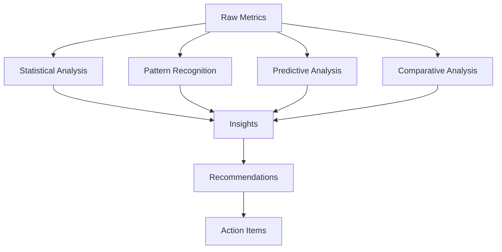

# Analyze Phase Documentation

## Overview

The Analyze phase transforms raw metrics from the Measure phase into actionable insights. This phase employs statistical analysis, pattern recognition, and machine learning to identify optimization opportunities and predict future performance.

## Objectives

- Identify performance bottlenecks
- Recognize patterns and trends
- Discover optimization opportunities
- Predict future behavior
- Generate actionable insights

## Analysis Framework

### Multi-Dimensional Analysis



## Trading Bot Analysis Components

### 1. Strategy Performance Analysis

```python
class StrategyAnalyzer:
    """Comprehensive strategy analysis system"""
    
    def analyze_strategy_performance(self, metrics_data):
        """Deep dive into strategy effectiveness"""
        analysis = {
            'performance': self.analyze_returns(metrics_data),
            'risk': self.analyze_risk_metrics(metrics_data),
            'efficiency': self.analyze_trade_efficiency(metrics_data),
            'market_conditions': self.analyze_market_impact(metrics_data),
            'optimization': self.identify_optimizations(metrics_data)
        }
        return analysis
    
    def analyze_returns(self, data):
        """Analyze return patterns and distributions"""
        returns = pd.Series(data['returns'])
        
        analysis = {
            'distribution': {
                'mean': returns.mean(),
                'std': returns.std(),
                'skewness': returns.skew(),
                'kurtosis': returns.kurt(),
                'normality_test': stats.normaltest(returns)
            },
            'performance': {
                'cumulative_return': (1 + returns).prod() - 1,
                'annualized_return': returns.mean() * 252,
                'volatility': returns.std() * np.sqrt(252),
                'downside_deviation': returns[returns < 0].std() * np.sqrt(252)
            },
            'patterns': {
                'autocorrelation': returns.autocorr(),
                'trend': self.identify_trend(returns),
                'seasonality': self.detect_seasonality(returns),
                'regime_changes': self.detect_regime_changes(returns)
            }
        }
        return analysis
    
    def analyze_risk_metrics(self, data):
        """Deep risk analysis"""
        returns = pd.Series(data['returns'])
        
        # Calculate various risk metrics
        var_95 = returns.quantile(0.05)
        cvar_95 = returns[returns <= var_95].mean()
        
        risk_analysis = {
            'value_at_risk': {
                '95%': var_95,
                '99%': returns.quantile(0.01)
            },
            'conditional_var': {
                '95%': cvar_95,
                '99%': returns[returns <= returns.quantile(0.01)].mean()
            },
            'drawdown_analysis': self.analyze_drawdowns(returns),
            'stress_testing': self.perform_stress_tests(returns),
            'correlation_risk': self.analyze_correlations(data)
        }
        return risk_analysis
```

### 2. Market Condition Analysis

```python
class MarketAnalyzer:
    """Analyze market conditions and their impact"""
    
    def analyze_market_conditions(self, market_data, strategy_performance):
        """Correlate market conditions with strategy performance"""
        
        # Market regime identification
        regimes = self.identify_market_regimes(market_data)
        
        # Performance by regime
        performance_by_regime = {}
        for regime in regimes:
            regime_data = strategy_performance[
                strategy_performance['timestamp'].isin(regime['periods'])
            ]
            performance_by_regime[regime['name']] = {
                'avg_return': regime_data['return'].mean(),
                'win_rate': (regime_data['return'] > 0).mean(),
                'volatility': regime_data['return'].std()
            }
        
        return {
            'regimes': regimes,
            'performance_by_regime': performance_by_regime,
            'optimal_conditions': self.identify_optimal_conditions(
                market_data, strategy_performance
            ),
            'adverse_conditions': self.identify_adverse_conditions(
                market_data, strategy_performance
            )
        }
    
    def identify_market_regimes(self, data):
        """Identify different market regimes using HMM"""
        from hmmlearn import hmm
        
        model = hmm.GaussianHMM(n_components=3, covariance_type="full")
        model.fit(data[['returns', 'volatility']])
        
        states = model.predict(data[['returns', 'volatility']])
        
        regimes = []
        for state in range(3):
            regime_data = data[states == state]
            regimes.append({
                'name': self.classify_regime(regime_data),
                'periods': regime_data.index.tolist(),
                'characteristics': {
                    'avg_return': regime_data['returns'].mean(),
                    'volatility': regime_data['volatility'].mean(),
                    'duration': len(regime_data)
                }
            })
        
        return regimes
```

### 3. Pattern Recognition Analysis

```python
class PatternAnalyzer:
    """Advanced pattern recognition in trading data"""
    
    def analyze_patterns(self, data):
        """Comprehensive pattern analysis"""
        patterns = {
            'technical': self.find_technical_patterns(data),
            'statistical': self.find_statistical_patterns(data),
            'ml_detected': self.ml_pattern_detection(data),
            'anomalies': self.detect_anomalies(data)
        }
        return patterns
    
    def find_technical_patterns(self, data):
        """Identify technical analysis patterns"""
        patterns = []
        
        # Head and Shoulders
        if self.is_head_and_shoulders(data):
            patterns.append({
                'type': 'head_and_shoulders',
                'confidence': self.calculate_pattern_confidence(data),
                'implications': 'Bearish reversal signal'
            })
        
        # Double Top/Bottom
        if self.is_double_top(data):
            patterns.append({
                'type': 'double_top',
                'confidence': self.calculate_pattern_confidence(data),
                'implications': 'Bearish reversal signal'
            })
        
        # Triangles
        triangle_type = self.identify_triangle(data)
        if triangle_type:
            patterns.append({
                'type': f'{triangle_type}_triangle',
                'confidence': self.calculate_pattern_confidence(data),
                'implications': self.get_triangle_implications(triangle_type)
            })
        
        return patterns
    
    def ml_pattern_detection(self, data):
        """Use machine learning for pattern detection"""
        from sklearn.ensemble import IsolationForest
        from sklearn.cluster import DBSCAN
        
        # Anomaly detection
        iso_forest = IsolationForest(contamination=0.1)
        anomalies = iso_forest.fit_predict(data[['price', 'volume']])
        
        # Clustering for pattern groups
        clustering = DBSCAN(eps=0.3, min_samples=10)
        clusters = clustering.fit_predict(data[['returns', 'volatility']])
        
        return {
            'anomalies': np.where(anomalies == -1)[0].tolist(),
            'pattern_clusters': self.analyze_clusters(clusters, data),
            'predictive_patterns': self.find_predictive_patterns(data)
        }
```

### 4. Bottleneck Analysis

```python
class BottleneckAnalyzer:
    """Identify and analyze system bottlenecks"""
    
    def analyze_bottlenecks(self, performance_data):
        """Comprehensive bottleneck analysis"""
        
        bottlenecks = {
            'execution': self.analyze_execution_bottlenecks(performance_data),
            'data_processing': self.analyze_data_bottlenecks(performance_data),
            'decision_making': self.analyze_decision_bottlenecks(performance_data),
            'resource': self.analyze_resource_bottlenecks(performance_data)
        }
        
        # Prioritize bottlenecks by impact
        prioritized = self.prioritize_bottlenecks(bottlenecks)
        
        return {
            'bottlenecks': bottlenecks,
            'priorities': prioritized,
            'recommendations': self.generate_optimization_recommendations(bottlenecks)
        }
    
    def analyze_execution_bottlenecks(self, data):
        """Analyze trade execution performance"""
        execution_times = data['execution_times']
        
        return {
            'avg_execution_time': np.mean(execution_times),
            'p95_execution_time': np.percentile(execution_times, 95),
            'slow_executions': len([t for t in execution_times if t > 1000]),  # > 1 second
            'bottleneck_periods': self.identify_slow_periods(execution_times),
            'root_causes': self.analyze_execution_delays(data)
        }
```

## Analysis Tools and Techniques

### Statistical Analysis Tools

```python
class StatisticalAnalyzer:
    """Advanced statistical analysis tools"""
    
    def perform_statistical_analysis(self, data):
        """Comprehensive statistical analysis"""
        
        analyses = {
            'descriptive': self.descriptive_statistics(data),
            'inferential': self.inferential_statistics(data),
            'time_series': self.time_series_analysis(data),
            'correlation': self.correlation_analysis(data),
            'regression': self.regression_analysis(data)
        }
        
        return analyses
    
    def time_series_analysis(self, data):
        """Time series decomposition and analysis"""
        from statsmodels.tsa.seasonal import seasonal_decompose
        from statsmodels.tsa.stattools import adfuller
        
        # Decomposition
        decomposition = seasonal_decompose(data['values'], period=30)
        
        # Stationarity test
        adf_result = adfuller(data['values'])
        
        # ARIMA model fitting
        arima_model = self.fit_arima(data['values'])
        
        return {
            'trend': decomposition.trend.tolist(),
            'seasonal': decomposition.seasonal.tolist(),
            'residual': decomposition.resid.tolist(),
            'is_stationary': adf_result[1] < 0.05,
            'forecast': arima_model.forecast(steps=30)
        }
```

### Machine Learning Analysis

```python
class MLAnalyzer:
    """Machine learning based analysis"""
    
    def ml_analysis(self, data):
        """Apply ML techniques for deeper insights"""
        
        # Feature engineering
        features = self.engineer_features(data)
        
        # Predictive modeling
        predictions = self.build_predictive_models(features)
        
        # Clustering analysis
        clusters = self.perform_clustering(features)
        
        # Feature importance
        importance = self.analyze_feature_importance(features)
        
        return {
            'predictions': predictions,
            'clusters': clusters,
            'feature_importance': importance,
            'insights': self.generate_ml_insights(predictions, clusters, importance)
        }
    
    def build_predictive_models(self, features):
        """Build various predictive models"""
        from sklearn.ensemble import RandomForestRegressor, GradientBoostingRegressor
        from sklearn.neural_network import MLPRegressor
        
        models = {
            'random_forest': RandomForestRegressor(n_estimators=100),
            'gradient_boosting': GradientBoostingRegressor(n_estimators=100),
            'neural_network': MLPRegressor(hidden_layer_sizes=(100, 50))
        }
        
        results = {}
        for name, model in models.items():
            model.fit(features['X_train'], features['y_train'])
            predictions = model.predict(features['X_test'])
            
            results[name] = {
                'predictions': predictions,
                'score': model.score(features['X_test'], features['y_test']),
                'feature_importance': self.get_feature_importance(model, features)
            }
        
        return results
```

## Analysis Visualization

### Interactive Dashboards

```python
import plotly.graph_objects as go
from plotly.subplots import make_subplots

class AnalysisVisualizer:
    """Create interactive analysis visualizations"""
    
    def create_analysis_dashboard(self, analysis_results):
        """Create comprehensive analysis dashboard"""
        
        fig = make_subplots(
            rows=3, cols=2,
            subplot_titles=(
                'Performance Distribution',
                'Risk Analysis',
                'Pattern Detection',
                'Bottleneck Analysis',
                'Market Regime Analysis',
                'Optimization Opportunities'
            )
        )
        
        # Performance distribution
        fig.add_trace(
            go.Histogram(x=analysis_results['returns'], name='Returns'),
            row=1, col=1
        )
        
        # Risk metrics
        fig.add_trace(
            go.Scatter(
                x=analysis_results['dates'],
                y=analysis_results['drawdowns'],
                name='Drawdowns'
            ),
            row=1, col=2
        )
        
        # Pattern detection results
        fig.add_trace(
            go.Scatter(
                x=analysis_results['dates'],
                y=analysis_results['pattern_signals'],
                mode='markers',
                name='Patterns'
            ),
            row=2, col=1
        )
        
        # Continue adding visualizations...
        
        fig.update_layout(height=1200, showlegend=True)
        return fig
```

## Analysis Automation

### Automated Analysis Pipeline

```python
class AutomatedAnalyzer:
    """Fully automated analysis pipeline"""
    
    def __init__(self):
        self.analyzers = {
            'strategy': StrategyAnalyzer(),
            'market': MarketAnalyzer(),
            'pattern': PatternAnalyzer(),
            'bottleneck': BottleneckAnalyzer(),
            'statistical': StatisticalAnalyzer(),
            'ml': MLAnalyzer()
        }
    
    def run_full_analysis(self, data):
        """Execute complete analysis pipeline"""
        
        results = {}
        
        # Run all analyzers in parallel
        with ThreadPoolExecutor(max_workers=len(self.analyzers)) as executor:
            futures = {
                executor.submit(analyzer.analyze, data): name
                for name, analyzer in self.analyzers.items()
            }
            
            for future in as_completed(futures):
                analyzer_name = futures[future]
                try:
                    results[analyzer_name] = future.result()
                except Exception as e:
                    print(f"Analysis failed for {analyzer_name}: {e}")
                    results[analyzer_name] = None
        
        # Synthesize results
        synthesis = self.synthesize_results(results)
        
        # Generate recommendations
        recommendations = self.generate_recommendations(synthesis)
        
        return {
            'detailed_results': results,
            'synthesis': synthesis,
            'recommendations': recommendations,
            'action_items': self.create_action_items(recommendations)
        }
```

## Analysis Commands

### Claude-Flow Analysis Commands

```bash
# Start analysis phase
npx claude-flow bmad analyze --data "metrics.json"

# Specific analysis types
npx claude-flow bmad analyze --type "performance" --depth "deep"
npx claude-flow bmad analyze --type "bottleneck" --component "execution"
npx claude-flow bmad analyze --type "pattern" --ml-enabled

# Generate analysis report
npx claude-flow bmad analyze --report --format "interactive"

# Real-time analysis
npx claude-flow bmad analyze --realtime --dashboard
```

## Integration with Other Phases

### From Measure to Analyze
- Import raw metrics
- Validate data quality
- Prepare for analysis

### To Document Phase
- Export analysis results
- Generate insight reports
- Create visualization assets

### Feedback to Build Phase
- Optimization recommendations
- Bug identification
- Performance improvements

## Conclusion

The Analyze phase transforms raw data into actionable insights through statistical analysis, machine learning, and pattern recognition. By systematically examining performance metrics, identifying bottlenecks, and discovering optimization opportunities, this phase drives continuous improvement in the BMAD cycle.

---

*Analyze Phase Documentation v2.0.0*
*Part of BMAD Methodology*