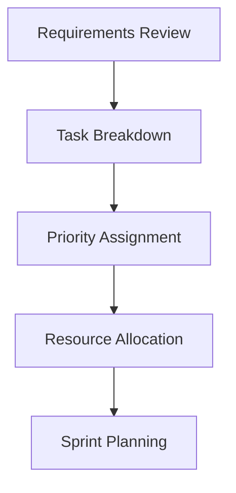

# Build Phase Documentation

## Overview

The Build phase is the foundation of the BMAD cycle, focusing on rapid prototyping and feature implementation. This phase emphasizes speed and functionality while maintaining code quality standards.

## Objectives

- Implement new features and capabilities
- Fix identified bugs and issues
- Refactor code for better maintainability
- Integrate new components and services

## Build Phase Process

### 1. Planning


### 2. Implementation Workflow

#### Step 1: Environment Setup
```bash
# Initialize build environment
npx claude-flow bmad build --init

# Setup development branch
git checkout -b feature/bmad-build-cycle
```

#### Step 2: Feature Development
```bash
# Start feature build
npx claude-flow bmad build "feature-name" \
  --priority high \
  --estimate 4h \
  --dependencies "api,database"
```

#### Step 3: Code Implementation
- Follow TDD principles
- Write clean, modular code
- Implement error handling
- Add logging and monitoring

## Trading Bot Specific Build Tasks

### Strategy Implementation
```python
# Example: Building a new trading strategy
class BMADStrategy(BaseStrategy):
    """BMAD-optimized trading strategy"""
    
    def __init__(self, config):
        super().__init__(config)
        self.build_phase_metrics = {}
        
    def build_indicator(self, params):
        """Build phase: Create new indicator"""
        # Rapid prototyping
        indicator = self.create_indicator(params)
        
        # Track build metrics
        self.build_phase_metrics['creation_time'] = time.time()
        self.build_phase_metrics['complexity'] = self.calculate_complexity()
        
        return indicator
    
    def build_signal_generator(self):
        """Build phase: Signal generation logic"""
        # Implementation focused on functionality
        pass
```

### API Integration Build
```python
# Building Alpaca API integration
class AlpacaIntegration:
    def build_connection(self):
        """Build phase: Establish API connection"""
        self.api = REST(
            key_id=self.config['api_key'],
            secret_key=self.config['secret_key'],
            base_url=self.config['base_url']
        )
        return self.validate_connection()
    
    def build_order_manager(self):
        """Build phase: Order management system"""
        # Rapid implementation of order logic
        pass
```

## Build Phase Best Practices

### 1. Code Quality Standards

#### Modular Design
- Single responsibility principle
- Maximum 500 lines per file
- Clear separation of concerns

#### Error Handling
```python
def build_component(self, spec):
    """Build with comprehensive error handling"""
    try:
        # Build logic
        component = self.create_component(spec)
        
        # Validation
        if not self.validate_component(component):
            raise BuildError("Component validation failed")
            
        return component
        
    except BuildError as e:
        self.log_build_error(e)
        return self.fallback_component()
    except Exception as e:
        self.log_critical_error(e)
        raise
```

### 2. Testing During Build

#### Test-Driven Development
```python
# Write test first
def test_new_indicator():
    """Test for new indicator in build phase"""
    indicator = BMADIndicator(period=14)
    data = generate_test_data()
    result = indicator.calculate(data)
    
    assert result is not None
    assert len(result) == len(data)
    assert all(0 <= val <= 100 for val in result)
```

#### Continuous Testing
```bash
# Run tests continuously during build
npx claude-flow bmad build --watch --test
```

### 3. Performance Considerations

#### Build Optimization
- Lazy loading for large components
- Caching frequently used data
- Parallel processing where possible

```python
class OptimizedBuilder:
    def __init__(self):
        self.cache = {}
        self.executor = ThreadPoolExecutor(max_workers=4)
    
    def build_parallel(self, components):
        """Build multiple components in parallel"""
        futures = []
        for component in components:
            future = self.executor.submit(self.build_single, component)
            futures.append(future)
        
        return [f.result() for f in futures]
```

## Build Phase Metrics

### Key Performance Indicators

| Metric | Target | Measurement |
|--------|--------|-------------|
| Build Time | < 5 min | CI/CD pipeline |
| Code Coverage | > 80% | Test suite |
| Lint Score | 100% | ESLint/Pylint |
| Complexity | < 10 | Cyclomatic complexity |
| Dependencies | Minimal | Dependency analyzer |

### Tracking Build Metrics
```python
class BuildMetrics:
    def __init__(self):
        self.metrics = {
            'start_time': None,
            'end_time': None,
            'files_changed': 0,
            'lines_added': 0,
            'lines_deleted': 0,
            'tests_added': 0,
            'build_status': 'pending'
        }
    
    def track_build(self, func):
        """Decorator to track build metrics"""
        def wrapper(*args, **kwargs):
            self.metrics['start_time'] = time.time()
            try:
                result = func(*args, **kwargs)
                self.metrics['build_status'] = 'success'
                return result
            except Exception as e:
                self.metrics['build_status'] = 'failed'
                raise
            finally:
                self.metrics['end_time'] = time.time()
                self.save_metrics()
        return wrapper
```

## Common Build Patterns

### 1. Feature Flags
```python
class FeatureBuilder:
    def build_with_flags(self, feature_name):
        """Build with feature flag support"""
        if self.is_feature_enabled(feature_name):
            return self.build_full_feature()
        else:
            return self.build_minimal_feature()
```

### 2. Progressive Enhancement
```python
def build_progressive(self):
    """Build core functionality first, enhance progressively"""
    # Core functionality
    core = self.build_core()
    
    # Enhancement layers
    if self.config.get('enable_advanced'):
        core = self.add_advanced_features(core)
    
    if self.config.get('enable_ml'):
        core = self.add_ml_capabilities(core)
    
    return core
```

### 3. Rollback Strategy
```python
class SafeBuilder:
    def build_with_rollback(self):
        """Build with automatic rollback on failure"""
        checkpoint = self.create_checkpoint()
        
        try:
            result = self.build_feature()
            self.validate_build(result)
            return result
        except BuildError:
            self.rollback_to(checkpoint)
            raise
```

## Build Phase Checklist

### Pre-Build
- [ ] Requirements reviewed and understood
- [ ] Dependencies identified and available
- [ ] Development environment configured
- [ ] Tests written (TDD approach)

### During Build
- [ ] Following coding standards
- [ ] Writing clean, modular code
- [ ] Implementing error handling
- [ ] Adding appropriate logging
- [ ] Running tests frequently

### Post-Build
- [ ] All tests passing
- [ ] Code reviewed (self or peer)
- [ ] Documentation updated
- [ ] Metrics collected
- [ ] Ready for Measure phase

## Integration with Other Phases

### Transition to Measure Phase
```bash
# Complete build and transition to measure
npx claude-flow bmad build --complete
npx claude-flow bmad measure --from-build
```

### Feedback from Analyze Phase
- Performance bottlenecks to address
- Code quality improvements needed
- Refactoring opportunities identified

### Documentation Requirements
- API documentation for new endpoints
- Updated configuration guides
- New feature usage examples

## Troubleshooting Common Issues

### Issue 1: Build Failures
```bash
# Debug build failures
npx claude-flow bmad build --debug --verbose

# Check build logs
tail -f logs/bmad-build.log
```

### Issue 2: Dependency Conflicts
```bash
# Resolve dependency issues
npm audit fix
pip install --upgrade -r requirements.txt
```

### Issue 3: Test Failures
```bash
# Run specific test suite
npm test -- --grep "build phase"
pytest tests/build/ -v
```

## Conclusion

The Build phase sets the foundation for the entire BMAD cycle. By focusing on rapid, quality implementation while maintaining measurability, the Build phase ensures that each iteration delivers value while providing data for continuous improvement.

---

*Build Phase Documentation v2.0.0*
*Part of BMAD Methodology*