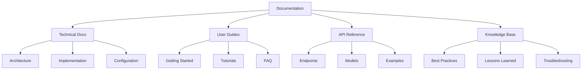

# Document Phase Documentation

## Overview

The Document phase captures and preserves knowledge gained throughout the BMAD cycle. This phase ensures that insights, implementations, and lessons learned are systematically recorded for future reference and continuous improvement.

## Objectives

- Capture implementation details
- Record analysis insights
- Document best practices
- Update configuration guides
- Maintain knowledge base
- Create training materials

## Documentation Framework

### Comprehensive Documentation Structure



## Trading Bot Documentation Components

### 1. Strategy Documentation

```python
class StrategyDocumenter:
    """Automated strategy documentation system"""
    
    def document_strategy(self, strategy):
        """Generate comprehensive strategy documentation"""
        
        doc = {
            'metadata': self.extract_metadata(strategy),
            'description': self.generate_description(strategy),
            'parameters': self.document_parameters(strategy),
            'logic': self.document_logic(strategy),
            'performance': self.document_performance(strategy),
            'examples': self.generate_examples(strategy),
            'risks': self.document_risks(strategy)
        }
        
        # Generate multiple formats
        self.generate_markdown(doc, f"docs/strategies/{strategy.name}.md")
        self.generate_api_docs(doc, f"docs/api/{strategy.name}.yaml")
        self.generate_jupyter_notebook(doc, f"examples/{strategy.name}.ipynb")
        
        return doc
    
    def generate_markdown(self, doc, filepath):
        """Generate markdown documentation"""
        content = f"""# {doc['metadata']['name']} Strategy Documentation

## Overview
{doc['description']}

## Parameters
{self.format_parameters_table(doc['parameters'])}

## Trading Logic
{doc['logic']['description']}

### Entry Conditions
{self.format_conditions(doc['logic']['entry_conditions'])}

### Exit Conditions
{self.format_conditions(doc['logic']['exit_conditions'])}

## Performance Metrics
{self.format_performance_table(doc['performance'])}

## Risk Considerations
{self.format_risks(doc['risks'])}

## Usage Examples

### Basic Implementation
```python
{doc['examples']['basic']}
```

### Advanced Configuration
```python
{doc['examples']['advanced']}
```

## Best Practices
{self.format_best_practices(doc)}

---
*Generated: {datetime.now().isoformat()}*
*Version: {doc['metadata']['version']}*
"""
        
        with open(filepath, 'w') as f:
            f.write(content)
```

### 2. API Documentation

```python
class APIDocumenter:
    """Generate OpenAPI/Swagger documentation"""
    
    def generate_api_documentation(self):
        """Create comprehensive API documentation"""
        
        openapi_spec = {
            "openapi": "3.0.0",
            "info": {
                "title": "Trading Bot API",
                "version": "2.0.0",
                "description": "Comprehensive trading bot API documentation"
            },
            "paths": self.document_endpoints(),
            "components": {
                "schemas": self.document_schemas(),
                "securitySchemes": self.document_security()
            }
        }
        
        # Save OpenAPI spec
        with open('docs/api/openapi.yaml', 'w') as f:
            yaml.dump(openapi_spec, f)
        
        # Generate interactive documentation
        self.generate_swagger_ui(openapi_spec)
        self.generate_postman_collection(openapi_spec)
        
        return openapi_spec
    
    def document_endpoints(self):
        """Document all API endpoints"""
        endpoints = {}
        
        # Trading endpoints
        endpoints['/api/v2/orders'] = {
            'post': {
                'summary': 'Place a new order',
                'operationId': 'placeOrder',
                'requestBody': {
                    'required': True,
                    'content': {
                        'application/json': {
                            'schema': {'$ref': '#/components/schemas/OrderRequest'}
                        }
                    }
                },
                'responses': {
                    '200': {
                        'description': 'Order placed successfully',
                        'content': {
                            'application/json': {
                                'schema': {'$ref': '#/components/schemas/OrderResponse'}
                            }
                        }
                    },
                    '400': {
                        'description': 'Invalid order parameters'
                    }
                }
            }
        }
        
        # Continue for all endpoints...
        return endpoints
```

### 3. Configuration Documentation

```python
class ConfigDocumenter:
    """Document system configuration"""
    
    def document_configuration(self):
        """Generate configuration documentation"""
        
        config_doc = f"""# Configuration Guide

## Environment Variables

| Variable | Description | Default | Required |
|----------|-------------|---------|----------|
| ALPACA_API_KEY | Alpaca API key | - | Yes |
| ALPACA_SECRET_KEY | Alpaca secret key | - | Yes |
| DATABASE_URL | Database connection string | sqlite:///trading.db | No |
| LOG_LEVEL | Logging level | INFO | No |
| REDIS_URL | Redis connection for caching | redis://localhost:6379 | No |

## Configuration Files

### config.yml
```yaml
trading:
  mode: paper  # paper or live
  max_position_size: 10000
  risk_per_trade: 0.02
  
strategies:
  stoch_rsi:
    enabled: true
    timeframe: 1h
    period: 14
    smoothing: 3
    
  ma_crossover:
    enabled: false
    fast_period: 10
    slow_period: 20
```

### Advanced Configuration

#### Database Configuration
```python
DATABASE_CONFIG = {
    'provider': 'postgresql',
    'host': 'localhost',
    'port': 5432,
    'database': 'trading_bot',
    'pool_size': 20,
    'max_overflow': 40
}
```

## Configuration Best Practices

1. **Security**
   - Never commit secrets to version control
   - Use environment variables for sensitive data
   - Rotate API keys regularly

2. **Performance**
   - Tune database connection pools
   - Configure appropriate cache TTLs
   - Optimize logging levels for production

3. **Reliability**
   - Set conservative risk parameters initially
   - Enable circuit breakers
   - Configure proper timeouts

## Configuration Validation

The system validates configuration on startup:

```python
validator = ConfigValidator()
validator.validate_config('config.yml')
```

## Dynamic Configuration

Some parameters can be updated without restart:

- Risk parameters
- Strategy enablement
- Logging levels
- Cache settings

Use the admin API to update:

```bash
curl -X PUT /api/admin/config \\
  -H "Content-Type: application/json" \\
  -d '{"trading.risk_per_trade": 0.01}'
```
"""
        
        with open('docs/CONFIGURATION.md', 'w') as f:
            f.write(config_doc)
        
        return config_doc
```

### 4. Knowledge Base Documentation

```python
class KnowledgeBaseDocumenter:
    """Maintain and update knowledge base"""
    
    def document_lessons_learned(self, cycle_data):
        """Document lessons from BMAD cycle"""
        
        lessons = {
            'cycle_id': cycle_data['id'],
            'date': datetime.now(),
            'successes': self.extract_successes(cycle_data),
            'failures': self.extract_failures(cycle_data),
            'insights': self.extract_insights(cycle_data),
            'recommendations': self.generate_recommendations(cycle_data)
        }
        
        # Add to knowledge base
        self.add_to_knowledge_base(lessons)
        
        # Generate lessons learned document
        doc = f"""# Lessons Learned - Cycle {lessons['cycle_id']}

## Date: {lessons['date'].strftime('%Y-%m-%d')}

## Successes
{self.format_list(lessons['successes'])}

## Challenges
{self.format_list(lessons['failures'])}

## Key Insights
{self.format_insights(lessons['insights'])}

## Recommendations for Next Cycle
{self.format_recommendations(lessons['recommendations'])}

## Metrics Comparison

| Metric | Previous | Current | Change |
|--------|----------|---------|--------|
{self.generate_metrics_comparison(cycle_data)}

## Action Items
{self.generate_action_items(lessons)}

---
*Documented by BMAD Document Phase*
"""
        
        filepath = f"docs/lessons_learned/cycle_{lessons['cycle_id']}.md"
        with open(filepath, 'w') as f:
            f.write(doc)
        
        return lessons
```

## Documentation Automation

### Auto-Documentation Pipeline

```python
class AutoDocumenter:
    """Automated documentation generation"""
    
    def __init__(self):
        self.documenters = {
            'strategy': StrategyDocumenter(),
            'api': APIDocumenter(),
            'config': ConfigDocumenter(),
            'knowledge': KnowledgeBaseDocumenter()
        }
        
    def run_documentation_pipeline(self, bmad_data):
        """Execute full documentation pipeline"""
        
        print("Starting documentation pipeline...")
        
        # Generate all documentation types
        docs = {}
        for doc_type, documenter in self.documenters.items():
            try:
                docs[doc_type] = documenter.document(bmad_data[doc_type])
                print(f"✓ {doc_type} documentation generated")
            except Exception as e:
                print(f"✗ Failed to generate {doc_type} docs: {e}")
        
        # Generate index and navigation
        self.generate_documentation_index(docs)
        
        # Update version control
        self.commit_documentation(docs)
        
        # Deploy to documentation site
        self.deploy_documentation(docs)
        
        return docs
    
    def generate_documentation_index(self, docs):
        """Create main documentation index"""
        
        index = f"""# Trading Bot Documentation

## Quick Links

- [Getting Started](./getting-started.md)
- [API Reference](./api/)
- [Configuration Guide](./CONFIGURATION.md)
- [Strategies](./strategies/)
- [BMAD Methodology](./BMAD/)

## Recent Updates

{self.get_recent_updates()}

## Documentation Structure

```
docs/
├── README.md (this file)
├── BMAD/
│   ├── methodology/
│   ├── phases/
│   ├── guides/
│   └── templates/
├── api/
│   ├── openapi.yaml
│   └── endpoints/
├── strategies/
│   ├── stoch_rsi.md
│   └── ma_crossover.md
├── guides/
│   ├── deployment.md
│   └── troubleshooting.md
└── lessons_learned/
    └── cycle_*.md
```

## Search Documentation

Use the search function to find specific topics:

```bash
grep -r "search_term" docs/
```

## Contributing

See [CONTRIBUTING.md](./CONTRIBUTING.md) for documentation guidelines.

---
*Last Updated: {datetime.now().isoformat()}*
"""
        
        with open('docs/README.md', 'w') as f:
            f.write(index)
```

### Documentation Templates

```python
class DocumentationTemplates:
    """Reusable documentation templates"""
    
    @staticmethod
    def strategy_template():
        """Template for strategy documentation"""
        return """# {name} Strategy

## Overview
{description}

## Configuration
```yaml
{config}
```

## Parameters

| Parameter | Type | Default | Description |
|-----------|------|---------|-------------|
{parameters}

## Trading Logic

### Entry Signals
{entry_logic}

### Exit Signals
{exit_logic}

## Risk Management
{risk_management}

## Performance History
{performance}

## Usage Example
```python
{example}
```

## Troubleshooting
{troubleshooting}

## Related Documentation
{related}

---
*Version: {version}*
*Last Updated: {timestamp}*
"""
    
    @staticmethod
    def api_endpoint_template():
        """Template for API endpoint documentation"""
        return """# {method} {path}

## Description
{description}

## Authentication
{authentication}

## Request

### Headers
```
{headers}
```

### Body
```json
{request_body}
```

### Parameters
{parameters}

## Response

### Success Response
```json
{success_response}
```

### Error Responses
{error_responses}

## Examples

### cURL
```bash
{curl_example}
```

### Python
```python
{python_example}
```

## Rate Limiting
{rate_limiting}

## Notes
{notes}
"""
```

## Documentation Validation

```python
class DocumentationValidator:
    """Validate documentation completeness and accuracy"""
    
    def validate_documentation(self):
        """Comprehensive documentation validation"""
        
        validations = {
            'completeness': self.check_completeness(),
            'accuracy': self.check_accuracy(),
            'consistency': self.check_consistency(),
            'currency': self.check_currency(),
            'accessibility': self.check_accessibility()
        }
        
        report = self.generate_validation_report(validations)
        
        if not all(v['passed'] for v in validations.values()):
            self.alert_documentation_issues(report)
        
        return report
    
    def check_completeness(self):
        """Verify all required documentation exists"""
        required_docs = [
            'README.md',
            'CONFIGURATION.md',
            'API.md',
            'DEPLOYMENT.md',
            'TROUBLESHOOTING.md'
        ]
        
        missing = []
        for doc in required_docs:
            if not os.path.exists(f"docs/{doc}"):
                missing.append(doc)
        
        return {
            'passed': len(missing) == 0,
            'missing': missing,
            'coverage': (len(required_docs) - len(missing)) / len(required_docs)
        }
```

## Documentation Commands

### Claude-Flow Documentation Commands

```bash
# Start documentation phase
npx claude-flow bmad document --cycle-id "abc123"

# Generate specific documentation
npx claude-flow bmad document --type "strategy" --name "stoch_rsi"
npx claude-flow bmad document --type "api" --format "openapi"
npx claude-flow bmad document --type "lessons" --cycle "current"

# Update all documentation
npx claude-flow bmad document --update-all

# Validate documentation
npx claude-flow bmad document --validate

# Generate documentation site
npx claude-flow bmad document --generate-site
```

## Integration with Other Phases

### From Analyze Phase
- Import analysis results
- Document insights and patterns
- Record optimization opportunities

### To Next Build Phase
- Provide implementation guides
- Share lessons learned
- Document technical debt

### Continuous Documentation
- Real-time updates during development
- Automated API doc generation
- Version-controlled documentation

## Documentation Best Practices

1. **Write as You Go**
   - Document during implementation
   - Update immediately after changes
   - Include context and rationale

2. **Keep It Current**
   - Regular review cycles
   - Automated validation
   - Version tracking

3. **Make It Searchable**
   - Clear structure
   - Comprehensive indexing
   - Good navigation

4. **Ensure Accessibility**
   - Multiple formats
   - Clear language
   - Visual aids

## Conclusion

The Document phase ensures that knowledge gained through the BMAD cycle is preserved and accessible. Through systematic documentation, automated generation, and continuous validation, this phase creates a comprehensive knowledge base that supports ongoing development and improvement.

---

*Document Phase Documentation v2.0.0*
*Part of BMAD Methodology*