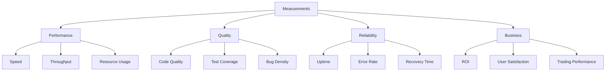

# Measure Phase Documentation

## Overview

The Measure phase quantifies the output of the Build phase, collecting critical metrics that drive data-driven decisions. This phase transforms subjective assessments into objective measurements.

## Objectives

- Collect performance metrics
- Measure quality indicators
- Track system reliability
- Quantify user experience
- Benchmark against targets

## Measurement Framework

### Core Metrics Categories



## Trading Bot Specific Metrics

### 1. Trading Performance Metrics

```python
class TradingMetrics:
    """Comprehensive trading performance measurement"""
    
    def measure_strategy_performance(self):
        """Measure trading strategy effectiveness"""
        metrics = {
            # Profitability Metrics
            'total_return': self.calculate_total_return(),
            'sharpe_ratio': self.calculate_sharpe_ratio(),
            'sortino_ratio': self.calculate_sortino_ratio(),
            'max_drawdown': self.calculate_max_drawdown(),
            
            # Trading Activity Metrics
            'total_trades': self.count_total_trades(),
            'winning_trades': self.count_winning_trades(),
            'losing_trades': self.count_losing_trades(),
            'win_rate': self.calculate_win_rate(),
            
            # Risk Metrics
            'value_at_risk': self.calculate_var(),
            'conditional_var': self.calculate_cvar(),
            'beta': self.calculate_beta(),
            'alpha': self.calculate_alpha(),
            
            # Efficiency Metrics
            'avg_trade_duration': self.calculate_avg_duration(),
            'profit_factor': self.calculate_profit_factor(),
            'recovery_factor': self.calculate_recovery_factor(),
            'calmar_ratio': self.calculate_calmar_ratio()
        }
        return metrics
```

### 2. System Performance Metrics

```python
class SystemMetrics:
    """System-level performance measurements"""
    
    def measure_system_performance(self):
        """Comprehensive system metrics"""
        return {
            # Latency Metrics
            'api_latency': self.measure_api_latency(),
            'order_execution_time': self.measure_execution_time(),
            'data_processing_time': self.measure_processing_time(),
            'signal_generation_time': self.measure_signal_time(),
            
            # Throughput Metrics
            'orders_per_second': self.calculate_order_throughput(),
            'ticks_processed': self.count_ticks_processed(),
            'signals_generated': self.count_signals(),
            
            # Resource Utilization
            'cpu_usage': self.measure_cpu_usage(),
            'memory_usage': self.measure_memory_usage(),
            'network_bandwidth': self.measure_bandwidth(),
            'disk_io': self.measure_disk_io(),
            
            # Reliability Metrics
            'uptime_percentage': self.calculate_uptime(),
            'error_rate': self.calculate_error_rate(),
            'failed_orders': self.count_failed_orders(),
            'reconnection_count': self.count_reconnections()
        }
```

### 3. Data Quality Metrics

```python
class DataQualityMetrics:
    """Measure data quality and integrity"""
    
    def measure_data_quality(self):
        """Assess data quality metrics"""
        return {
            # Completeness
            'missing_data_points': self.count_missing_data(),
            'data_coverage': self.calculate_coverage(),
            
            # Accuracy
            'price_accuracy': self.verify_price_accuracy(),
            'volume_accuracy': self.verify_volume_accuracy(),
            
            # Timeliness
            'data_latency': self.measure_data_latency(),
            'update_frequency': self.measure_update_frequency(),
            
            # Consistency
            'data_anomalies': self.detect_anomalies(),
            'validation_failures': self.count_validation_failures()
        }
```

## Measurement Implementation

### Automated Metric Collection

```python
class MetricCollector:
    """Automated metric collection system"""
    
    def __init__(self):
        self.metrics_store = {}
        self.collection_interval = 60  # seconds
        
    @measure_execution_time
    def collect_metrics(self):
        """Collect all metrics automatically"""
        timestamp = datetime.now()
        
        # Collect different metric categories
        self.metrics_store[timestamp] = {
            'trading': self.collect_trading_metrics(),
            'system': self.collect_system_metrics(),
            'quality': self.collect_quality_metrics(),
            'custom': self.collect_custom_metrics()
        }
        
        # Store in database
        self.persist_metrics(self.metrics_store[timestamp])
        
        # Trigger alerts if thresholds exceeded
        self.check_thresholds(self.metrics_store[timestamp])
        
    def schedule_collection(self):
        """Schedule periodic metric collection"""
        scheduler = BackgroundScheduler()
        scheduler.add_job(
            func=self.collect_metrics,
            trigger="interval",
            seconds=self.collection_interval
        )
        scheduler.start()
```

### Real-time Monitoring

```python
class RealTimeMonitor:
    """Real-time metric monitoring"""
    
    def __init__(self):
        self.websocket = None
        self.dashboard_url = "http://localhost:5000/metrics"
        
    async def stream_metrics(self):
        """Stream metrics in real-time"""
        async with websockets.connect(self.dashboard_url) as ws:
            self.websocket = ws
            
            while True:
                metrics = self.get_current_metrics()
                await ws.send(json.dumps(metrics))
                await asyncio.sleep(1)  # Update every second
    
    def get_current_metrics(self):
        """Get current metric snapshot"""
        return {
            'timestamp': time.time(),
            'cpu': psutil.cpu_percent(),
            'memory': psutil.virtual_memory().percent,
            'active_orders': self.count_active_orders(),
            'current_pnl': self.calculate_current_pnl(),
            'positions': self.get_open_positions()
        }
```

## Measurement Tools and Commands

### Claude-Flow Measurement Commands

```bash
# Start measurement phase
npx claude-flow bmad measure --start

# Measure specific components
npx claude-flow bmad measure "trading-performance" --duration 1h
npx claude-flow bmad measure "system-resources" --interval 5s
npx claude-flow bmad measure "data-quality" --continuous

# Generate measurement report
npx claude-flow bmad measure --report --format json
```

### Performance Profiling

```python
import cProfile
import pstats
from memory_profiler import profile

class PerformanceProfiler:
    """Profile code performance"""
    
    @profile  # Memory profiler decorator
    def profile_memory_usage(self):
        """Profile memory consumption"""
        # Code to profile
        pass
    
    def profile_execution_time(self, func):
        """Profile execution time"""
        profiler = cProfile.Profile()
        profiler.enable()
        
        result = func()
        
        profiler.disable()
        stats = pstats.Stats(profiler)
        stats.sort_stats('cumulative')
        stats.print_stats(10)  # Top 10 time consumers
        
        return result
```

## Measurement Dashboards

### Trading Dashboard Metrics

```html
<!-- Real-time metrics dashboard -->
<div class="metrics-dashboard">
    <div class="metric-card">
        <h3>Trading Performance</h3>
        <div class="metric-value" id="total-return">+15.3%</div>
        <div class="metric-chart" id="return-chart"></div>
    </div>
    
    <div class="metric-card">
        <h3>System Health</h3>
        <div class="metric-value" id="uptime">99.95%</div>
        <div class="metric-indicators">
            <span class="indicator green">API</span>
            <span class="indicator green">Data Feed</span>
            <span class="indicator yellow">Backup</span>
        </div>
    </div>
    
    <div class="metric-card">
        <h3>Risk Metrics</h3>
        <div class="metric-value" id="current-risk">Low</div>
        <div class="risk-gauge" id="risk-meter"></div>
    </div>
</div>
```

### Metric Visualization

```javascript
// Real-time metric visualization
class MetricVisualizer {
    constructor() {
        this.charts = {};
        this.initializeCharts();
    }
    
    initializeCharts() {
        // Performance chart
        this.charts.performance = new Chart('performance-chart', {
            type: 'line',
            data: {
                labels: [],
                datasets: [{
                    label: 'Returns',
                    data: [],
                    borderColor: 'rgb(75, 192, 192)',
                    tension: 0.1
                }]
            },
            options: {
                responsive: true,
                scales: {
                    y: {
                        beginAtZero: true
                    }
                }
            }
        });
    }
    
    updateMetrics(data) {
        // Update charts with new data
        this.charts.performance.data.labels.push(data.timestamp);
        this.charts.performance.data.datasets[0].data.push(data.return);
        this.charts.performance.update();
    }
}
```

## Measurement Best Practices

### 1. Comprehensive Coverage
- Measure all critical paths
- Include edge cases
- Track both success and failure

### 2. Consistent Methodology
- Standardized metric definitions
- Regular collection intervals
- Normalized data formats

### 3. Actionable Metrics
- Focus on decision-driving metrics
- Set clear thresholds
- Link metrics to actions

### 4. Performance Impact
- Minimize measurement overhead
- Use sampling for high-frequency events
- Asynchronous collection where possible

## Metric Storage and Retention

```python
class MetricStorage:
    """Efficient metric storage system"""
    
    def __init__(self):
        self.db = self.connect_db()
        self.retention_policy = {
            'raw': timedelta(days=7),
            'hourly': timedelta(days=30),
            'daily': timedelta(days=365),
            'monthly': timedelta(days=1825)  # 5 years
        }
    
    def store_metrics(self, metrics):
        """Store metrics with appropriate granularity"""
        # Store raw metrics
        self.store_raw(metrics)
        
        # Aggregate for long-term storage
        self.aggregate_hourly(metrics)
        self.aggregate_daily(metrics)
        self.aggregate_monthly(metrics)
        
        # Clean old data
        self.apply_retention_policy()
```

## Alert and Threshold Management

```python
class MetricAlerts:
    """Alert system for metric thresholds"""
    
    def __init__(self):
        self.thresholds = {
            'max_drawdown': -0.10,  # -10%
            'error_rate': 0.01,  # 1%
            'latency': 100,  # 100ms
            'cpu_usage': 80,  # 80%
            'memory_usage': 90  # 90%
        }
    
    def check_thresholds(self, metrics):
        """Check metrics against thresholds"""
        alerts = []
        
        for metric, value in metrics.items():
            if metric in self.thresholds:
                threshold = self.thresholds[metric]
                
                if self.is_threshold_exceeded(value, threshold):
                    alerts.append(self.create_alert(metric, value, threshold))
        
        if alerts:
            self.send_alerts(alerts)
```

## Measurement Reports

### Automated Report Generation

```python
class MeasurementReporter:
    """Generate measurement reports"""
    
    def generate_report(self, period='daily'):
        """Generate comprehensive measurement report"""
        report = {
            'period': period,
            'generated_at': datetime.now(),
            'summary': self.generate_summary(),
            'details': self.generate_details(),
            'trends': self.analyze_trends(),
            'recommendations': self.generate_recommendations()
        }
        
        # Export in multiple formats
        self.export_json(report)
        self.export_pdf(report)
        self.export_html(report)
        
        return report
```

## Integration with Other Phases

### From Build to Measure
- Automatically measure build outputs
- Track build performance metrics
- Validate build quality

### To Analyze Phase
- Provide raw data for analysis
- Highlight anomalies and trends
- Flag areas requiring attention

### To Document Phase
- Supply metrics for documentation
- Generate performance reports
- Create metric dashboards

## Conclusion

The Measure phase transforms subjective assessments into objective data, providing the foundation for informed decision-making in the BMAD cycle. Through comprehensive metric collection, real-time monitoring, and automated reporting, this phase ensures that every aspect of the trading bot's performance is quantified and tracked.

---

*Measure Phase Documentation v2.0.0*
*Part of BMAD Methodology*