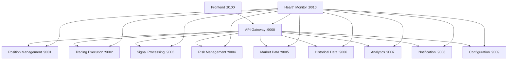

# Microservices Architecture Documentation

## Overview

This project implements a microservices-based trading bot system using Docker containers. Each service runs independently and communicates through a central API Gateway.

## Port Allocation (9000 Range)

| Service | Port | Description |
|---------|------|-------------|
| **API Gateway** | 9000 | Central entry point, request routing, authentication |
| **Position Management** | 9001 | Portfolio positions, account data |
| **Trading Execution** | 9002 | Order execution, Alpaca API integration |
| **Signal Processing** | 9003 | Trading signals, StochRSI/EMA calculations |
| **Risk Management** | 9004 | Risk assessment, position sizing |
| **Market Data** | 9005 | Real-time market data, price feeds |
| **Historical Data** | 9006 | Historical data storage and retrieval |
| **Analytics** | 9007 | Performance analytics, P&L tracking |
| **Notification** | 9008 | Email/SMS alerts, trade notifications |
| **Configuration** | 9009 | System configuration, settings management |
| **Health Monitor** | 9010 | Service health checks, system monitoring |
| **Frontend** | 9100 | Web dashboard, user interface |

## Service Dependencies



## API Gateway Routes

The API Gateway (port 9000) routes requests to appropriate microservices:

### Account & Portfolio Routes
- `GET /api/account` → Position Management Service (9001)
- `GET /api/positions` → Position Management Service (9001)
- `GET /api/portfolio/*` → Position Management Service (9001)

### Trading Routes
- `GET /api/orders` → Trading Execution Service (9002)
- `POST /api/orders` → Trading Execution Service (9002)
- `DELETE /api/orders/{id}` → Trading Execution Service (9002)

### Market Data Routes
- `GET /api/chart/{symbol}` → Market Data Service (9005)
- `GET /api/latest/{symbol}` → Market Data Service (9005)
- `GET /api/market_status` → Market Data Service (9005)

### Signal Routes
- `GET /api/signals` → Signal Processing Service (9003)
- `GET /api/indicators/{symbol}` → Signal Processing Service (9003)

### Analytics Routes
- `GET /api/analytics/*` → Analytics Service (9007)

### Configuration Routes
- `GET /api/config` → Configuration Service (9009)
- `POST /api/config` → Configuration Service (9009)

### Monitoring Routes
- `GET /api/monitoring/*` → Health Monitor Service (9010)
- `GET /health` → Health Monitor Service (9010)

## Service Responsibilities

### 1. API Gateway (Port 9000)
- **Purpose**: Central entry point for all client requests
- **Responsibilities**:
  - Request routing to appropriate microservices
  - Authentication and authorization
  - Rate limiting and circuit breaker patterns
  - Request/response logging
  - CORS handling
- **Technology**: FastAPI
- **Key Features**:
  - Service discovery integration
  - Load balancing
  - Request validation
  - Error handling and retries

### 2. Position Management (Port 9001)
- **Purpose**: Manage portfolio positions and account data
- **Responsibilities**:
  - Track current positions
  - Calculate portfolio value
  - Manage account information
  - Position sizing calculations
- **API Endpoints**:
  - `GET /positions` - List all positions
  - `GET /account` - Account information
  - `GET /portfolio/summary` - Portfolio overview

### 3. Trading Execution (Port 9002)
- **Purpose**: Execute trades through Alpaca API
- **Responsibilities**:
  - Order placement and management
  - Alpaca API integration
  - Order status tracking
  - Trade execution logging
- **API Endpoints**:
  - `POST /orders` - Place new order
  - `GET /orders` - List orders
  - `DELETE /orders/{id}` - Cancel order

### 4. Signal Processing (Port 9003)
- **Purpose**: Generate trading signals
- **Responsibilities**:
  - StochRSI calculations
  - EMA calculations
  - Signal generation logic
  - Technical indicator analysis
- **API Endpoints**:
  - `GET /signals/{symbol}` - Get signals for symbol
  - `GET /indicators/{symbol}` - Get technical indicators

### 5. Risk Management (Port 9004)
- **Purpose**: Assess and manage trading risks
- **Responsibilities**:
  - Position size calculations
  - Risk assessment
  - Stop loss management
  - Maximum drawdown monitoring
- **API Endpoints**:
  - `POST /risk/assess` - Assess trade risk
  - `GET /risk/limits` - Get risk limits

### 6. Market Data (Port 9005)
- **Purpose**: Provide real-time and historical market data
- **Responsibilities**:
  - Alpaca market data integration
  - Real-time price feeds
  - Chart data provision
  - Market status information
- **API Endpoints**:
  - `GET /chart/{symbol}` - Chart data
  - `GET /quote/{symbol}` - Latest quote
  - `GET /market-status` - Market status

### 7. Historical Data (Port 9006)
- **Purpose**: Store and retrieve historical market data
- **Responsibilities**:
  - Historical data storage
  - Data caching for 24/7 access
  - Backtesting data provision
- **API Endpoints**:
  - `GET /historical/{symbol}` - Historical data
  - `GET /cache/stats` - Cache statistics

### 8. Analytics (Port 9007)
- **Purpose**: Provide trading performance analytics
- **Responsibilities**:
  - P&L calculations
  - Performance metrics
  - Trade history analysis
  - Reporting and dashboards
- **API Endpoints**:
  - `GET /analytics/summary` - Performance summary
  - `GET /analytics/trades` - Trade history
  - `GET /analytics/pnl-history` - P&L over time

### 9. Notification (Port 9008)
- **Purpose**: Send alerts and notifications
- **Responsibilities**:
  - Email notifications
  - SMS alerts
  - Trade confirmations
  - System alerts
- **API Endpoints**:
  - `POST /notifications/send` - Send notification
  - `GET /notifications/settings` - Get settings

### 10. Configuration (Port 9009)
- **Purpose**: Manage system configuration
- **Responsibilities**:
  - Trading parameters
  - System settings
  - User preferences
  - Environment configuration
- **API Endpoints**:
  - `GET /config` - Get configuration
  - `POST /config` - Update configuration

### 11. Health Monitor (Port 9010)
- **Purpose**: Monitor system health and performance
- **Responsibilities**:
  - Service health checks
  - System metrics collection
  - Performance monitoring
  - Alert generation
- **API Endpoints**:
  - `GET /health` - Overall system health
  - `GET /metrics` - System metrics
  - `GET /services` - Service status

### 12. Frontend (Port 9100)
- **Purpose**: Web-based user interface
- **Responsibilities**:
  - Dashboard rendering
  - User interaction handling
  - Real-time updates via WebSocket
  - Chart visualization
- **Pages**:
  - `/` - Main dashboard
  - `/portfolio` - Portfolio management
  - `/trading` - Trading interface
  - `/analytics` - Analytics and reports
  - `/config` - Configuration
  - `/monitoring` - System monitoring

## Communication Patterns

### 1. Synchronous HTTP
- Client → API Gateway → Microservice
- Used for: CRUD operations, data queries
- Protocol: REST API with JSON

### 2. Asynchronous Messaging
- Service → Redis → Service
- Used for: Event notifications, background tasks
- Protocol: Redis Pub/Sub

### 3. WebSocket (Real-time)
- Frontend ↔ API Gateway ↔ Services
- Used for: Live updates, real-time data
- Protocol: WebSocket with JSON messages

## Data Storage

### PostgreSQL Database
- **Position Management**: Portfolio positions, account data
- **Trading Execution**: Order history, trade logs
- **Analytics**: Performance metrics, trade analysis
- **Configuration**: System settings, user preferences

### Redis Cache
- **Market Data**: Real-time price caching
- **Session Storage**: User sessions, temporary data
- **Message Queue**: Inter-service communication

## Deployment

### Docker Compose
```bash
# Start all services
docker-compose up -d

# Start specific service
docker-compose up -d trading-execution

# View logs
docker-compose logs -f api-gateway

# Scale services
docker-compose up -d --scale trading-execution=3
```

### Local Development
```bash
# Start individual services for development
cd microservices/services/api-gateway
python app/main.py

# Or use the start script
./start_service.sh api-gateway 9000
```

## Security

### Authentication
- JWT tokens for API access
- Service-to-service authentication
- API key management for external services

### Network Security
- Internal Docker network isolation
- Environment variable for secrets
- HTTPS/TLS for external communication

## Monitoring and Logging

### Health Checks
- Each service exposes `/health` endpoint
- Health Monitor service aggregates status
- Docker health checks configured

### Logging
- Structured logging with JSON format
- Centralized log collection
- Log levels: DEBUG, INFO, WARNING, ERROR

### Metrics
- Performance metrics collection
- Resource usage monitoring
- Custom business metrics

## Scaling Considerations

### Horizontal Scaling
- Stateless service design
- Load balancing through API Gateway
- Database connection pooling

### Performance Optimization
- Redis caching strategy
- Database query optimization
- Async/await patterns for I/O

## Error Handling

### Circuit Breaker Pattern
- Prevent cascade failures
- Automatic retry mechanisms
- Fallback responses

### Graceful Degradation
- Service availability checks
- Default responses for unavailable services
- User-friendly error messages

## Future Enhancements

1. **Service Mesh**: Implement Istio for advanced traffic management
2. **Message Queues**: Add RabbitMQ/Kafka for complex event processing
3. **API Versioning**: Implement versioning strategy for backward compatibility
4. **Auto-scaling**: Implement container orchestration with Kubernetes
5. **Distributed Tracing**: Add Jaeger for request tracing across services